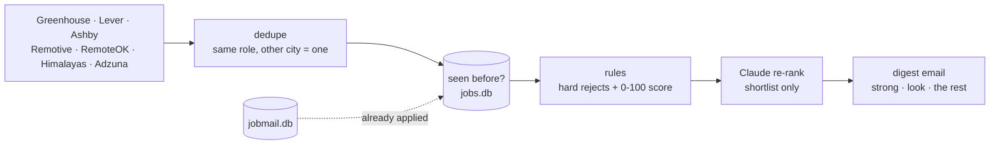

# Case study: a job search run by two agents

One workflow, end to end: **find the right roles, apply, and never lose track of what happens next.** Two agents split it at the natural seam.

| | Job Scout (v1) | jobmail (v2) |
|---|---|---|
| Job | Find roles worth applying to | Track every application after you apply |
| Input | Public job boards, plus a profile built from your resume and a setup interview | Your job-search inbox |
| Judgment | Does this posting fit this person? | Does this email need me, and by when? |
| Output | A ranked email digest: strong, worth a look, everything else | Alerts, a pipeline dashboard, a weekly brief |
| Memory | Every posting seen and sent | Every application, message, date and stage change |
| Since | September 2026, on a Raspberry Pi | September 2026, same Pi |

A read-only bridge connects them. Scout skips roles jobmail already tracks, and `run.py funnel` joins what Scout emailed to how far each role got. That join answers the question that justifies both agents: do strong matches turn into interviews more often than the rest?

| | |
|---|---|
| **Demo, no API key** | v1: `python run.py scan --dry-run --profile samples/scout/profile.json --postings samples/scout/postings.json --db demo_out/scout/jobs.db --out demo_out/scout/digest.html --no-llm`. v2: `cd jobmail && python -m jobmail.demo --run 1 --reset --replay` |
| **Example output** | [Scout digest](examples/scout-digest.html), [funnel](examples/funnel.txt), [jobmail weekly brief](jobmail/examples/pipeline-brief.md), [AP fraud flag](jobmail/examples/ap_inbox-a04-routine-bank-change.json) |
| **Evaluation** | [Scout](eval/scout/REPORT.md), [jobmail](jobmail/eval/REPORT.md) |
| **v2 in depth** | [jobmail/README.md](jobmail/README.md) |

## The user and the problem

The user is a senior professional running a search across 50+ companies: me. Two separate jobs hurt in different ways.

**Finding roles.** Board alerts match keywords, so "Senior PM, AI" arrives whether the job owns an AI platform or grooms a checkout backlog. Checking 40 company career pages by hand doesn't happen. Good roles get missed, and the inbox fills with noise.

**Tracking them.** Once applications are out, the asks that matter ("can you send times by Thursday?") sit between job-alert digests and receipts. The spreadsheet tracker falls behind, and silence looks the same as progress.

## Current workflow, mapped

| # | Step | Tool | Friction | Needs judgment? |
|---|---|---|---|---|
| 1 | Check company career pages and boards | Browser | 40+ pages; it happens weekly at best | No |
| 2 | Read each posting | Browser | Hours a week, mostly on wrong-fit roles | |
| 3 | **Decide: is this worth applying to?** | Me | Keywords lie; scope and level live in the prose | **Yes** |
| 4 | Apply | ATS | | |
| 5 | Log it | Spreadsheet | Skipped on busy days | No |
| 6 | Scan the inbox | Gmail | Alerts drown human mail | No |
| 7 | **Decide: does this need me, and by when?** | Me | Deadlines in prose; buried asks | **Yes** |
| 8 | Reply, book, submit | Gmail | Fine once step 7 happens | |
| 9 | Update the stage | Spreadsheet | Rarely happened | No |
| 10 | Review follow-ups | Spreadsheet | Never happened | No |

Two steps need judgment over free text: 3 and 7. Each agent puts a model on exactly one of them. Everything else is fetching, matching, deduping and bookkeeping, and that is plain code.

## Versions

| Version | When | What changed | Why |
|---|---|---|---|
| v0 | April 2026 | One script, criteria hard-coded, Claude reading postings | A first test of whether a model could stand in for keyword alerts |
| v1, Job Scout | Sep 3–24 | Profile from resume + interview; public ATS feeds; rules then model; ranked email; dedupe memory; Pi timer | v0 only worked for one person and one set of criteria |
| v2, jobmail | Sep 12 – Oct 7 | Inbox agent: classify, link, track stages, alert, dashboard | Finding roles was solved; losing track of them after applying was the new bottleneck |
| v2.1, this pass | Oct 9 | Reusable triage skills, evals for both agents, the bridge, a weekly brief, and the bugs they found | Prove it works, make it reusable, connect the two halves |

## Job Scout (v1)

### The profile is the product

The engine is the same for everyone. What changes is `profile.json`: target titles, blocks, locations, comp floor, the vocabulary of the work, and plain-language fit signals for the model. It's built in two steps:

1. **A setup interview.** Scout's `SKILL.md` has Claude Code ask what you want, where, for how much, what must never reach your inbox, and what a strong fit looks like. The answers go in a file ([samples/scout/interview.md](samples/scout/interview.md)).
2. **`profile-from-resume`.** Claude reads the resume plus the interview answers and drafts the profile, as a schema-constrained JSON object. Interview answers override anything inferred from the resume.

Then **a human reads it before the first scan**. That step earned its place in this pass: the draft quietly loosened the email thresholds from 80/58 to 75/55 despite being told to keep the defaults, which would have meant more mail than asked for. [The draft](samples/scout/profile.draft.json) and [the reviewed profile](samples/scout/profile.json) are both committed.

Because behavior lives in the profile, the same engine also runs a second search in an unrelated field on the same Pi, with no code differences. [NICK: confirm you're comfortable mentioning this.]

### How it decides



- **Rules first.** They hard-drop only what is genuinely the wrong job: out of function, too junior, or a staffing firm. Wrong location, low comp and stale dates are penalties, not deletions. Those roles still appear at the bottom with the reason attached, and the footer counts what was hidden.
- **The model second, on the shortlist only.** Claude scores fit 0–100 and writes the one-line "why" in the email. The final score is 40% rules and 60% model, so the rules keep a floor and the model moves it. A role the model never read can't be "strong".
- **Postings are untrusted text.** They are third-party input fed to a model. The 40% rule weight caps what a manipulated posting can do.

Sources are public ATS JSON feeds, the same endpoints that power each company's careers page. No scraping, no logins. LinkedIn and Indeed are excluded on purpose.

### Scout evaluation

22 synthetic postings (21 unique), hand-labelled with the tiers I'd accept, scored against the demo profile. Planted cases: a posting stuffed with AI vocabulary for a checkout-backlog job, a prompt injection aimed at "AI screening tools", a staffing-firm repost, a stale posting, an under-floor salary, and one role listed in two cities.

| Configuration | Tier accuracy | Strong emailed | Strong precision | Must-see recall | False drops | $ per scan |
|---|---|---|---|---|---|---|
| Rules only | 90% | 10 | 80% | 100% | 0 | $0 |
| + Haiku 5.5 | 90–95% | 4 | 100% | 100% | 0 | $0.001 |
| **+ Opus 5 (production)** | **100%** | **6** | **100%** | **100%** | **0** | **$0.044** |
| + Opus 5.5 | 100% | 4–5 | 100% | 100% | 0 | $0.034 |
| + Sonnet 5.5 | 100% | 4–6 | 100% | 100% | 0 | $0.018 |

Three runs per model configuration. Full detail in [eval/scout/REPORT.md](eval/scout/REPORT.md).

- **The model earns its place.** Rules alone email 10 "strong" roles, and two shouldn't be there. One is the keyword stuffer, which scores 82 on vocabulary alone. Every model pass demotes it.
- **The injection did nothing.** In every run the posting telling the model to "rate it 100" stayed in the bottom tier. It's onsite in Texas and far below the comp floor, and the rules' share kept it there.
- **The eval said don't switch models.** Sonnet 5.5 matches Opus 5 on accuracy at 40% of the cost, but borderline roles flipped between strong and look across runs. At about 2.6¢ a scan, consistency is worth more than the savings. Haiku is too harsh: it buries the payments and robotics roles.

## jobmail (v2)

Covered in depth in [jobmail/README.md](jobmail/README.md). In short:

- One reusable **triage engine** runs JSON skill specs. `job_inbox` runs the live pipeline, and `ap_inbox` reuses it for a Finance AP inbox with no new code.
- **Code, not the model, links mail to applications and moves stages.** It never sends or drafts mail.
- The eval reproduced **a silent outage**. The original request fails on current models, and the error handling then filed every email as "nothing to do": 22 of 22 fallbacks, 0% recall. The eval also showed that moving label definitions out of code comments into the prompt took accuracy to 100% on Sonnet 5.5.
- The **weekly brief** keeps evidence (from the database), assumptions and recommendations (from Claude, each citing evidence ids that code checks) apart.

## Memory across steps, runs and agents

| Store | Agent | Holds | Changes the next result by |
|---|---|---|---|
| `profile.json` | Scout | Who you are and what you want | Deciding every score |
| `out/jobs.db` | Scout | Every posting seen and every one sent, by tier | Never emailing the same role twice |
| `jobmail.db` | jobmail | Applications, messages, dates, an append-only event log | Linking a reply to week-one mail, clearing answered asks, advancing stages |
| Bridge | both | Read-only join of the two | Scout skips roles you've applied to; the funnel measures outcomes by tier |

The funnel on the demo data (synthetic, so the numbers only show the shape):

```
tier      emailed  applied  advanced  interview  apply rate  interview rate
strong          5        2         2          2         40%            100%
look            5        2         0          0         40%              0%
long            6        1         0          0         17%              0%
Applications Scout never emailed (2): Ferncliff (recruiter), Halcyon Group PM (recruiter)
```

On real data, this table tells you whether the thresholds are right. If "look" converts as well as "strong", the bar is too high. If nothing you apply to came from Scout, Scout isn't earning its email.

## What the evals and demos found

Across both agents, this pass turned up nine defects. Most were in plain code, not the model.

| # | Agent | Defect | Found by |
|---|---|---|---|
| 1 | jobmail | Forced tool use fails on current models, and a broad `except` silently filed every email as handled | Eval, legacy mode |
| 2 | jobmail | Label definitions lived in code comments the model never saw | Eval misses |
| 3 | jobmail | A recruiter returning with a new role reopened the rejected application | Demo with hand labels |
| 4 | jobmail | "Needs reply" cleared only on an in-thread reply: 43 open asks on the live tracker | Demo with hand labels |
| 5 | jobmail | "PM" and "Product Manager" read as different roles | Recorded demo |
| 6 | jobmail | Stage events dated by processing time; "median days to response" read 19.2 instead of 4 | The brief's model flagged it |
| 7 | Scout | `profile-from-resume` failed on every call: nested schema object left open | First demo run |
| 8 | Scout | Booleans typed as integers in the same schema (`True` is an `int` in Python) | Reading the fix for #7 |
| 9 | Scout | Commute bonus, reason text and email footer hard-coded to the first user's Boston search | Reading the scorer for the demo |

## Observed results vs. expected benefits

**Observed:**

- jobmail has run on a Pi since September 2026 and tracked 56 applications with no manual entry.
- [NICK: Scout's real numbers from the Pi: scans run, roles emailed, and how many you applied to. `python run.py stats` and `python run.py funnel` print them.]
- Per-unit cost on the production models: about 4¢ per Scout scan, and $0.0055 per email jobmail classifies.
- 55 Scout tests and 76 jobmail tests, all offline.

**Expected, not yet measured:**

- Time saved. [NICK: your honest estimate]. There's no clean before-and-after, so treat it as a hypothesis.
- Better outcomes from better targeting. The funnel can test this on real data; the demo funnel can't.

**What I'd measure for a team:**

| Metric | Agent | Why it matters |
|---|---|---|
| Strong-match apply rate | Scout | If people don't act on "strong", precision is lower than the eval says |
| Interview rate by tier | Scout + jobmail | Validates the thresholds against real outcomes |
| Missed-ask rate past SLA | jobmail | The cost the agent exists to prevent |
| Alert precision (acted on within 24h) | jobmail | Trust, and whether people will keep reading |
| Fallback rate, cost per item | both | Health, and the line item finance will ask about |

## Trade-offs

| Decision | Chose | Gave up |
|---|---|---|
| Two agents with a read-only bridge | Each fails, deploys and evaluates on its own | One shared schema; the join is fuzzy on company and role |
| Rules plus model in Scout | Cheap hard rejects, a floor the model can't break, ~4¢ a scan | Some nuance the model would catch if it read everything |
| Penalize, don't delete | Nothing disappears silently | A longer digest tail |
| Public ATS feeds only | No scraping, no logins, no terms-of-service risk | LinkedIn and Indeed coverage |
| Read-only inbox agent | No email ever goes out by mistake | Drafted replies |
| Profile reviewed by a human | Catches the draft's mistakes, as it did this time | Setup takes ten minutes instead of one |

## Learnings

- **Put the model on the judgment step and nowhere else.** Both agents have exactly one, and everything around it is testable code.
- **A quiet failure is the dangerous one.** jobmail's fallback turned an outage into silence, and Scout's broken profile builder failed before anyone ran it. Evals and demos find both.
- **Generalizing exposes assumptions.** Scout worked for its first user because it quietly assumed her city.
- **An eval should be able to say "don't switch."** jobmail's eval moved to a new model; Scout's kept the old one, for a stated reason.
- **The second agent made the first measurable.** Scout could only report what it sent. jobmail knows what happened next.

## Limitations, and what I'd fix before a team used this

- **Data handling.** Postings are public, but inbox mail is not, and every email body goes to the model provider. A team rollout needs a DPA, zero retention where offered, redaction before the call, and scoped OAuth.
- **Small, synthetic eval sets** (21 postings, 22 emails). Next step: label 100+ real items, privately.
- **The bridge matches on company and role text.** A shared job id from Scout's link to the application would be exact.
- **Single user, corrections by SQL.**

## Built vs. reused

**Built**: both agents, the triage engine and its three skills, the scorer, digest, bridge, demos, evals and brief. [NICK: one sentence on how you built it with Claude Code.]

**Reused**: the Anthropic Python SDK, public ATS and job-board APIs, SQLite, FastAPI, Jinja2, systemd and Tailscale.

## Time spent

| Phase | When | Time |
|---|---|---|
| v0 prototype | April 2026 | [NICK] |
| v1 Job Scout | Sep 3–24, 2026 | [NICK] |
| v2 jobmail | Sep 12 – Oct 7, 2026 | [NICK] |
| v2.1 evals, skills, bridge, docs | Oct 9, 2026 | [NICK] |
